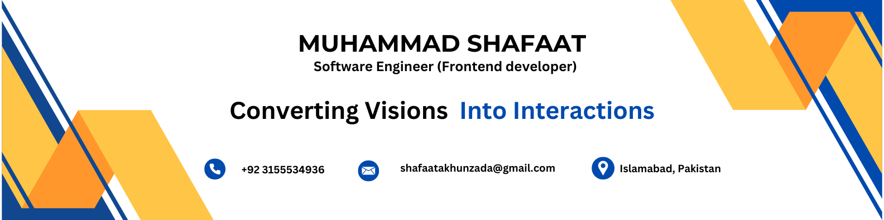

<!--Banner12388774567891586077805711-->

<!--Night Owl image-->

  

<!--Header Name-->
#  ɪ'ᴠMuhammad Shafaat! 
*Digital Craftsman (Developer / Programmer)*
  

<!--Start Intro-->               

I am a Frontend Developer with 5 years of experience building responsive, user-focused web applications using React. I thrive on turning imagination and user requirements into real, interactive experiences. I love working with modern UI frameworks, component-based architectures, REST APIs, and performance-optimized design systems.

- 🌱 I’m currently learning many things, I believe that everyday is a learning opportunity.
- 📽 I'm Currently working as a Software Engineer.
- 🙋‍♂️ Ask me about React, UI/UX, design systems, performance tuning, and building interactive web apps — these are my jam! Feel free to reach out and talk frontend with me.
- ❤ Experienced in version control systems like Git and collaboration through GitHub, fast API, Axios, UI/UX and state management.

<!--Languages and Tools Section-->       
<h2 align="center">Lᴀɴɢᴜᴀɢᴇs ᴀɴᴅ Tᴏᴏʟs</h2> 

<!--   -->

---

## Education

- **Degree:** [B.Sc](https://www.university-website.com)
  - Institution: [University of Engineering and Technology Peshawar](https://www.uetpeshawar.edu.pk/)
  - Field of Study: [Computer Software Engineering](https://www.university-website.com/department)
  - Graduation Year: [2019]

<!--Dynamic Quote card updated everyday at 12 PM--> 
<h2 align="center">🌟 Tʜᴏᴜɢʜᴛ ᴏғ ᴛʜᴇ Dᴀʏ 🌟</h2>
<!--STARTS_HERE_QUOTE_CARD-->

    

<!--Contact Section--> 

<h2 align="center">🤝 Cᴏɴɴᴇᴄᴛ Wɪᴛʜ Mᴇ 🤝 </h2>

 
  

 

<!--Footer--> 

  

